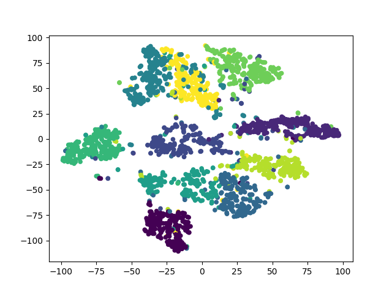
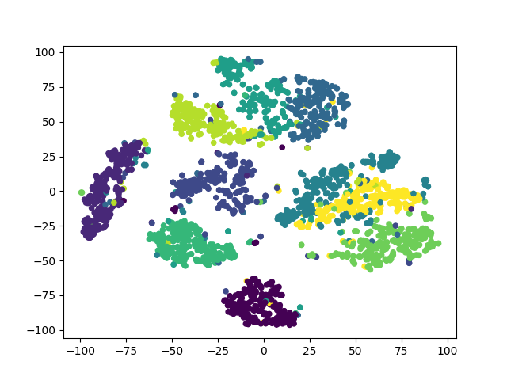

# t-SNE pytorch Implementation with CUDA
`pytorch` implementation of algorithm described in [Visualizing Data using t-SNE](https://lvdmaaten.github.io/publications/papers/JMLR_2014.pdf). This code support cuda accelerating.

## How to use it
Just download the repository, and the put feature file and labels file with code
1. run without cuda support
```bash
python tsne_torch.py --xfile mnist2500_X.txt --yfile mnist2500_labels.txt --cuda 0
```
2.run with cuda support 
```bash
python tsne_torch.py --xfile mnist2500_X.txt --yfile mnist2500_labels.txt --cuda 1
```

## Requirements
* pytorch
* matplotlib, numpy


## Example
This is our result compare to result of python implementation.
* pytorch result

* python result



## Credit
This code highly inspired by 
* author's python implementation code [here](https://lvdmaaten.github.io/tsne/).
